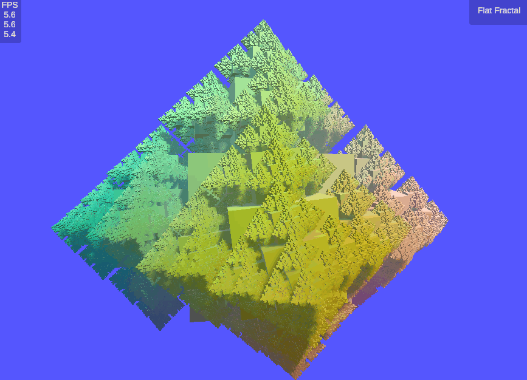

# My Unity Surfaces and Fractals
Various C#/HLSL samples for Unity with a focus on comparing different ways to render geometry and the variations in performance. Includes my implementations of Jasper Flick's demos on compute shaders, Unity Jobs, and organic variety from <a href="https://catlikecoding.com/">Catlike Coding</a>. My code may serve as a reference for learners who want to have the final source code to compare their own project to. My code works with Unity 2021, and I use the default standard render pipeline. To use with URP, the shaders must be convereted to ShaderGraph.

<!--

-->

## Organic Fractals

Adds randomness to fractals for an organic feel. It uses Unity Jobs with Burst compiler optimization. Performance is lower (100 FPS) than the fractal below because this one uses spheres instead of cubes, and spheres have more vertices. However, because the organic fractal supports varying meshes at different levels, we made the leaf nodes (the most numerous nodes in the fractal) cubes, which allows a fractal to consist mostly of spheres while maintaining a framerate above 60 FPS. (Note: utilizing all spheres at this depth achieved a performance of around 30-40 FPS).

## Fractals
Rendering 100K+ cubes using different techniques: using CPU for positioning and instantiating cubes, using CPU for positioning and compute shaders for procedurally drawing, and using Unity Jobs for parallelizing the positioning algorithm and compute shaders for procedurally drawing. The Jobs fractal performs the fastest, and is optimized using the <a href="https://docs.unity3d.com/Manual/com.unity.burst.html">Burst compiler</a> which translates C# code to native code using LLVM.

|Compute Shader + Burst Compiler (270 FPS)| 
|:---:|
||

|Compute Shader (40 FPS)| 
|:---:|
||

|CPU Only (5 FPS)| 
|:---:|
||

## GPU Surfaces

90K cubes rendered procedurally on the GPU with compute shaders for implementing the mathematical functions at over 500 FPS.

## CPU Surfaces

10K cubes instantiated on the CPU at less than 60 FPS. 